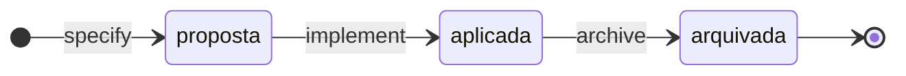
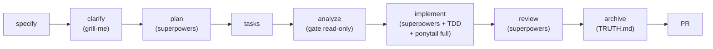

# sdd-iuri

Framework de **Spec-Driven Development por delta specs** para o [Claude Code](https://claude.com/claude-code): cada feature declara **só o que muda** (ADICIONA/MUDA/REMOVE), e a fonte da verdade (`specs/TRUTH.md`) cresce a cada archive. O framework orquestra; plugins de terceiros executam as fases — quando um falta, a fase degrada com aviso, nunca quebra.

Divisão de responsabilidade: **grill-me previne construir a coisa errada; Superpowers previne construir sem disciplina; ponytail previne construir demais.**

## Como funciona

Uma feature = uma delta spec em `specs/NNN-nome/`, com três estados:



No archive, a delta move para `specs/_archive/` e consolida no `TRUTH.md` — deltas antigas são histórico, não verdade. O caminho entre os estados é o ciclo do `/sdd-iuri:spec-feature`:



Os gates determinísticos rodam **local**, na fase analyze/archive e no pré-commit: `skills/spec-feature/scripts/check_cycle.py` (ciclo, checks C1–C7) e `skills/guarding-doc-integrity/scripts/validate_integrity.py` (espelhos de valores canônicos). Ambos têm `--selftest` validado no CI deste repo.

## Instalação

Três comandos, tudo dentro do Claude Code — não há cópia manual de arquivos.

Os dois primeiros registram o marketplace e instalam o framework (no REPL do Claude Code):

```
/plugin marketplace add iuripereira/sdd-iuri
/plugin install sdd-iuri@sdd-iuri
```

O terceiro instala os motores de terceiros que o ciclo delega — um comando no terminal, que roda o [scripts/instala-motores.sh](scripts/instala-motores.sh) (com o repo clonado, chame o script direto):

```bash
curl -fsSL https://raw.githubusercontent.com/iuripereira/sdd-iuri/main/scripts/instala-motores.sh | bash
```

| Motor | O que executa no ciclo |
|---|---|
| `superpowers` | plan · implement · review |
| `ponytail` | anti-over-engineering always-on |
| `max` | clarify (grill-me / grill-with-docs) |

As skills ficam sob o namespace `sdd-iuri:`. O `/sdd-iuri:projeto-init` confere os motores na inicialização de cada projeto; faltando algum, a fase que depende dele degrada com aviso em vez de quebrar.

Pré-requisitos para o módulo de infra: `gh` autenticado e remote no GitHub. Contratos, fallbacks e política de versões: `skills/spec-feature/references/adapters.md`.

### CLIs de documentação visual (gate doc-profile — ADR-0009)

Diagram-as-code renderizado por CLI. Só o Mermaid é **obrigatório** (default do doc-profile); instale os demais somente se o `doc-profile.yaml` do projeto os declarar:

```bash
# Obrigatório — fluxogramas, sequência, ERD rápido; renderiza nativo no GitHub/Obsidian
npm install -g @mermaid-js/mermaid-cli          # mmdc

# Opcionais — instale só o que o doc-profile do projeto declarar
npm install -g @softwaretechnik/dbml-renderer   # modelo de dados canônico (schema.dbml)
sudo apt install plantuml default-jre graphviz  # UML formal e casos de uso (.puml)
curl -fsSL https://d2lang.com/install.sh | sh -s --   # arquitetura visual moderna (.d2)
docker pull structurizr/cli                     # C4 formal via Structurizr DSL

# Entregável cliente (skill doc-entregavel — PDF/DOCX assinável)
pip install pypandoc-binary python-docx markdown   # + google-chrome para o PDF
```

O bloco de entregável só é necessário em projeto com `publico.cliente: true` no `doc-profile.yaml`.

## Os comandos

| Comando | Quando usar | O que faz |
|---|---|---|
| `/sdd-iuri:projeto-init` | uma vez por repositório | Detecta o tipo (app-web · backend · site-estatico · workspace-dados · tooling), gera o `CLAUDE.md` a partir das regras canônicas, cria o scaffold (CHANGELOG, STATE, DEBT, ADRs, `specs/` + TRUTH.md nos tipos com ciclo), oferece a infra e confere os plugins. Nunca sobrescreve nada |
| `/sdd-iuri:projeto-infra` | após criar o remote GitHub; ou avulsa em repo existente | Branch protection (rulesets), CI, Conventional Commits, release-please (changelog PT-BR), CodeRabbit/claude-code-action. Idempotente: 2ª rodada = no-op relatado |
| `/sdd-iuri:spec-feature` | a cada incremento de feature | Orquestra o ciclo: specify → clarify → plan → tasks → analyze → implement → review → archive → PR. Cria `specs/NNN-nome/`, numeração global, branch semântica; no archive consolida o `TRUTH.md` |
| `/sdd-iuri:spec-review` | opcional, antes do implement | Revisão adversarial da spec/plan via grill-me — recomendada quando a spec toca segurança, dados persistentes, contrato externo ou dependência nova |
| `/sdd-iuri:guarding-doc-integrity` | quando um valor de negócio vive em mais de um arquivo | Governança de fontes de verdade: manifesto `deps.toml` (dono → espelhos sancionados) + validador determinístico como gate pré-commit. É o executor da "regra de propagação" do `CLAUDE.md` |
| `/sdd-iuri:handoff` | ao encerrar a sessão de trabalho (argumento opcional: foco da próxima) | Fecha a sessão nos registros com dono: atualiza o `STATE.md` (diário de bordo), roteia débito/lição novo para o `DEBT.md` (DT-NNN), cita a delta em curso com fase e gate e imprime o prompt de retomada da próxima sessão |
| `/sdd-iuri:doc-entregavel` | no `momento` declarado no `doc-profile.yaml` (`entrega-prd`, `fechamento-fase`) — projeto com `publico.cliente: true` | Congela o entregável cliente: renderiza os diagramas do perfil (mmdc/dbml-renderer), monta o documento com capa de assinatura parametrizada e exporta PDF/DOCX versionado em `docs/entregaveis/`. **Experimental** (ADR-0009, piloto imex-travelplanner) |

### Skill de estilo (fora do ciclo)

`eu-tenho-tdah` não é um comando do ciclo — é o perfil de escrita pessoal do Iuri (baseado em [ayghri/i-have-adhd](https://github.com/ayghri/i-have-adhd)), always-on: prioriza ação sobre contexto, listas sempre ranqueadas, tangentes viram pendência salva (em `DEBT.md`, quando dentro de um projeto sdd-iuri) em vez de sugestão solta no texto.

## Caminho feliz (greenfield)

Projeto vazio ou só com um prompt-rascunho:

1. `/sdd-iuri:projeto-init` na pasta → tipo detectado (pasta vazia: ele pergunta), `CLAUDE.md` + scaffold.
2. Crie o repo no GitHub (`gh repo create ... --source .`) e rode `/sdd-iuri:projeto-infra` (ou aceite a oferta do init). Rulesets exigem repo público ou GitHub Pro.
3. `/sdd-iuri:spec-feature` → **delta-001 = walking skeleton** (a menor fatia vertical funcional — nunca "o sistema inteiro"). O prompt-rascunho vira insumo do specify/clarify; a visão além do skeleton vira seção "Não implementado" do TRUTH.md.
4. Repita `/sdd-iuri:spec-feature` por incremento. O `TRUTH.md` é a soma dos archives.

## Brownfield (projeto com SDD anterior)

Tudo é **idempotência defensiva** — nada é sobrescrito nem migrado sem pedido:

- `CLAUDE.md` existente → o init gera `CLAUDE.generated.md` + diff; você decide o merge.
- Scaffold: só cria o que falta; `.gitignore` recebe append; `docs/specs/` antigos ficam como estão (o ciclo novo vive em `specs/`, o histórico antigo não é tocado).
- `TRUTH.md` nasce vazio e cresce com as **novas** deltas; para backfill do que já vige, sumarize o estado atual nele (tarefa assistida, sob demanda).
- `/sdd-iuri:projeto-infra` consulta o que já existe (rulesets, workflows) e só preenche lacunas.
- Numeração NNN continua do maior existente; nunca reinicia.

## Convenções deste repositório

`main` protegida por ruleset: mudanças só via PR com o check `ci` verde (valida JSON, TOML, YAML, frontmatter dos SKILL.md, os `--selftest` dos gates, a portabilidade dos caminhos — RNF5 — e a integridade documental via `deps.toml`) e commits no padrão Conventional Commits.

O framework é aplicado a si mesmo: as convenções vivem no [CLAUDE.md](CLAUDE.md), o andamento no [STATE.md](STATE.md) (diário de bordo), o débito e as lições no [DEBT.md](DEBT.md), as decisões em [docs/adrs/](docs/adrs/) e o que vige em [specs/TRUTH.md](specs/TRUTH.md). As skills ficam em `skills/`; o manifesto do plugin em `.claude-plugin/plugin.json`.
